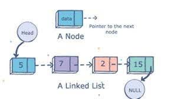
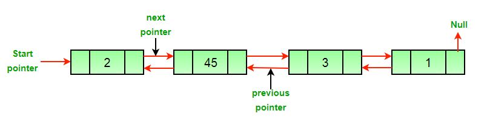

# Linked List
In this tutorial, you'll learn what is a linked list and how to implement it in Python. There are several kinds of linked lists: singly, doubly, and circular, but we mainly focus on a doubly-linked list here for now. 

## `WHAT IS A LINKED LIST??`
Features of a linked list :
* a linear data structure
* including data called node
* each node has a data item and an address of the next node. 
* whose first node called Head and the last is called Tail

<!-- ## `Ok, but, Why does each node have a value and an address to the next node?` -->
## `OK, BUT, WHY DOES EACH NODE HAVE A VALUE AND AN ADDRESS TO THE NEXT NODE?`
That's because data in an array can be stored randomly in memory. For, example, when you define an array [1, 2, 3, 4, 5], possibly the order of data in the array is not always the same in memory. Thus, linked lists organize data randomly too. However, each node in a linked list has two stuff, a value and **an pointer to the next node**, we can keep our list together and give us quick access to each element when we need it. 

Most of linked lists have two address in a pointer: an address to previous and next nodes. A doubly linked list is named so because of the number of address a pointer of each node includes. In other words, it's a **bi-directional** list!!!!

## **`INSERTING`**
One of the biggest advantage of a linked list is the speed, in another word, Big O notation. Because of pointers, You only have to do some stuff on neighboring values in the linked list during inserting. Unlike a dynamic array, we don't have to move all of the values when you insert a value into a linked list. 

Representation for inserting a value into a linked list. 
* NEW_NODE = a new node inserted into the linked list
* HEAD = the first value in the linked list
* TAIL = the end value in teh linked list
* CURRENT = a value before NEW_NODE

### **Inserting at the head**
Steps to insert a value in the head:
1. create NEW_NODE
2. set the address for the next value of NEW_NODE to current HEAD
3. set the address for the previous value of HEAD to NEW_NODE
4. set HEAD of the linked list to NEW_NODE

### **Inserting at the tail**
It looks very similar to inserting at the head, so I recommend comparing the both steps for inserting at the head and tail.
1. create NEW_NODE
2. set the address for the previous value of NEW_NODE to current TAIL
3. set the address for the next value of current TAIL to NEW_NODE
4. set TAIL of the linked list to NEW_NODE

### **Inserting in the middle**
It's a bit more complicated. Below are the steps:
1. create NEW_NODE
2. set the address for the next value of NEW_NODE to NODE_AFTER_CURRENT
3. set the address for the previous value of NEW_NODE to CURRENT
4. set the address for the next value of CURRENT to NEW_NODE
5. set the address for the previous value of NODE_AFTER_CURRENT to NEW_NODE

### **Special Case**
If there was no node in the linked list, all we need to do is to set HEAD and TAIL to NEW_NODE.
## **`REMOVING`**
You should be so confused now and not even want to learn about removing a value from a linked lis, but don't leave!! I promise that removing a value from a linked list is much more simple and easier to understand than inserting. So, let's get started. 
* AFTER_NODE is a node after the deleted node.
* BEFORE_NODE is a node before the deleted node.
### **Removing the first value**
What you have to do is just two things: 1. remove the first value from the linked list and 2. set the previous address of the second node to the HEAD.
1. set the address for the previous value of the second node in the linked list to nothing (because the first node is deleted and no address for the previous value of the second node.)
2. set the HEAD to be the second node.

### **Removing the last value**
Likely to the process of inserting, it's very similar to removing the first value. 
1. set the address for the next value of the second to last node in the linked list to nothing (because the last node is deleted and no address for the next value of the second to last node.)
2. set the TAIL to be the second to last node.

### **Removing a value from the middle**
You got lucky, dude!! It won't be as tricky as inserting in the middle. The only two steps necessary are below:
1. set the address for the previous value of AFTER_NODE to BEFORE_NODE
2. set the address for the next value of BEFORE_NODE to AFTER_NODE

### **Special Case**
If there was only one node in the linked list, all we need to do is to set HEAD and TAIL to NONE, so we can create an empty list.

[back to welcome page](welcome.md)