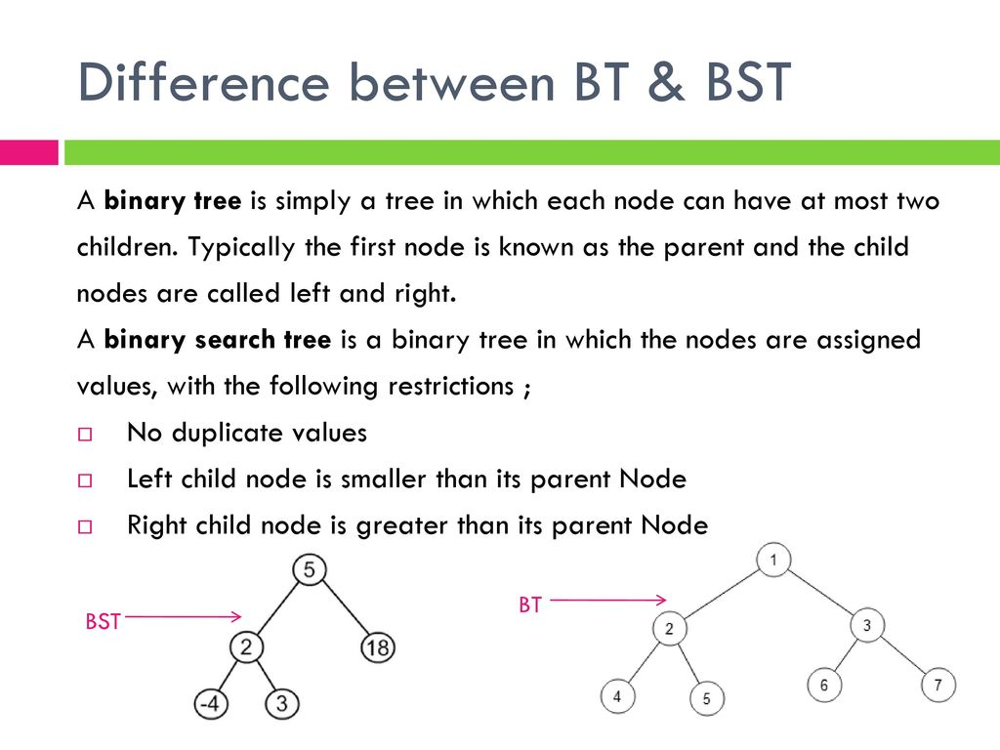
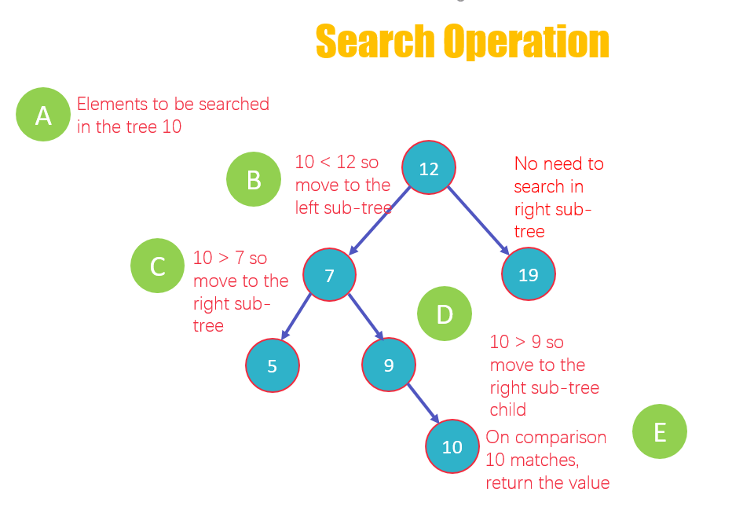

# Tree
## `WHAT IS A TREE??`

Yeah, that's right. It's a tree 99% of people would imagine if I asked tham what a tree is. But, forget about it. What you will learn is a tree as a data structure in python and it is the most efficient structure. Have fun!!

## `WHAT ARE TREES IN PROGRAMMING??`
Trees in programming look like linked lists, but as a node in a linked list has data and pointers for the next and previous node, a node in a tree has data and pointers for the previous node and for one or two next nodes. **A node in a tree can connect two node like a tree in the real world.** That's the biggest reason why this data structure is called a tree. It looks like a tree in real, it's called a tree. 

There are some kinds of trees: Binary Trees, Binary Search Trees, and Balanced Binary Search Trees. You will learn how these trees are different from each other, binary search tree operations, then see how the code of Binary Search Trees looks like. 

## `1. BINARY TREES`
This is the most simple and no-sorted tree. In here, I will explain how a tree is constructed, what the rules are, and about 5 terms about trees you need to know. 

So, only what you know now about trees is each node can have multiple next nodes. In addition to that, a tree has to have the only one **"root"** at the top, which is the first data that is put into the tree. Nodes at the bottom not connected to any other nodes in a tree structure are called a **"leaf"** node. When you look at the picture below, nodes H, I, J, F, and G are leaves. On the other hand, nodes connected to other nodes are a **"parent"** node, node B, D, E, and C in the picture. A **"child"** node is a node who has a parent node. A **"sub-tree"** is like a small tree in the tree structure that consists of a parent's nodes. 


## `2. BINARY SEARCH TREES`
NO, IT'S NOT BTS, ONE OF THE MOST FAMOUS AND FANCIEST SOUTH KOREAN BAND, BUT BST. 

So, why it is called a *"binary"* *"search"* tree? 
The reasons are below. 
* Binary: because each tree node has a maximum of two nodes.
* Search: because it is mainly used to search for the presence of a number in O(log(n)) time.

Binary search trees is a tree, but unlike binary trees, follow some rules for data added into the tree. 
The rules are:
* No duplicates are allowed to put into a tree. 
* A left child of parents has to be smaller than the parent
* A right child of parents has to be larger than the parent



Let's create a tree and say we have a list of numbers [3, 4, 1, 5, 2] and the first number in the list is added into a tree. We need to delete the first number when we successfully added into the tree.
1. Because there is no root in the tree, 3 becomes the root. 
2. The next number is 4 which is larger 3, so it's going to be the right node of the root. 
3. Next, 1 is smaller than 3, so it's now the left node. 
4. Now, we have 5. It is larger than 3 but not 9, so it's going to be the left node of 9
5. The next number is 2, smaller than 3 larger than 1, so going to be the right node of 1
```
                          3
                        /   \
                      1       4
                        \       \
                          2       5
```
This is what the tree looks like. 
Another example to imagine how inserting is going is below. 


I would like to ask you what Big O of searching a specific value would be. It is O(log n) because every time you finished comparing values and know which (left or right) to go, you can ignore the other subtree. The process to discard one of the subtrees over and over until finding the value leads O(log n) performance, which is really fast and efficient. In a dynamic array or a linked list, we just compare each value at the top in the list and only one value can be no need to compare at a time, which cause O(n) performance. 


## A Special Case
However, there is a special case. What if numbers are added into a tree in this order [1, 2, 3, 4, 5]??
```
  1
    \
      2
        \
          3
            \
              4
                \
                  5
```
The tree above are the same structure as a linked list, so the performance of searching a certain data is O(n). How can we avoide such unbalanced binary search trees?? Go ahead and scroll down.

## `3. BALANCED BINARY SEARCH TREES`
BSTs sometimes cause O(log n) performance, but balancesd BSTs can avoid such poor performance. A bBST is a BST, but the only but huge difference from a normal BST is that the difference of height between any two subtrees is not really different. It is not so difficult to find The height of a tree; you have to do is just to count the maximum number of nodes between root and the leaves. Because it is not ideal that the order of data will lead a balanced BST, so many algorithms have been written to distinguish if a tree is a balanced BST and if not, transform it into a balanced BST.

## AVL Trees
AVL (Adelson-Velskii and Landis) Trees are one of the most famous trees that has a great pre-determined algorithm that can detect if a tree is unbalanced or not. If it is unbalanced, the algorithm can turn it into a balanced tree after each modification such as inserting and removing.

What it does to correct unbalance is to change and replace nodes that cause the unbalance. **For each node in AVL tree, the height of left and right subtrees can only differ by 1 at most.** Let me try to visualize AVL Trees. 
Let's say we have the tree below and 15 is added into it, 
```
                          6
                        /   \
                      3       9
                                \
                                  11
```
The tree would be like this if the tree is not an AVL tree. 
```
                          6
                        /   \
                      3       9
                                \
                                  11
                                    \
                                      15
```
The height of left and right subtrees are 1 and 3, differing by 2. This is now unbalanced and doesn't assure the O(log n) performance anymore.

However, if this was an AVL tree, differing by 2 would have never happened thanks to the algorithm. When the tree detects differing by 2, rotation of nodes happens to correct the unbalance. The order [9, 11, 15] causes it an unbalanced tree, so the algorithm set 11 to the root of the right subtree. Because 9 is smaller than 11, 9 would be the left node of 11 and 15 would be the right node of 11. Finally, the heights are 1 and 2 which is a balanced BST. An AVL Tree is always a balanced BST. The tree should be like this below. 
```
                          6
                        /   \
                      3       11
                            /    \
                          9        15
```
[If you are interested, here is a website you can simulate AVL Trees.](https://www.cs.usfca.edu/~galles/visualization/AVLtree.html)

## `OPERATIONS`
BST operations are very complicated in comparison to operations of any other data structures. We are going to explore only inserting. Otherwise, you may freak out. 

## Inserting
Because we need to keep looking for a proper place to add a value until we find, it's recursive. Do you remember the two thing we need to declare before writing recursive code?? They are 1. smaller problem and 2. base case. 
1. Smaller problem: put a value into a proper place (left or right sub tree) based on the value.
2. Base case: If we has been found an empty place where we can add the value into, the item can be inserted.

```python
class BST:
    class Node:
        # This is similar to what we did in the linked list page. We called a value added as node and the code looks same as well. We know the value, but don't know the left and right place yet so that set them to none.  
        def __init__(self, data):
            self.data = data
            self.left = None
            self.right = None
        # Functions starting with double underscores in Python are built-in functions in Python which means a great enginner somewhere in the world has already writen. 

    def __init__(self):
        # This is called when you first want to insert a value. If it is the first time to insert a value, the tree must be empty. The only case the tree is empty is if it doesn't have root. 
        self.root = None

    def inserting(self, data):
        # There are two insert functions: inserting() and _inserting(). This function is only called once to check if the tree has root. If the tree doesn't have root, set the added value as the root. If not, finding a correct place to put the value into will start (calling _inserting() function). 
        if self.root is None:
            self.root = BST.Node(data)
        else:
            # First, compare the added value to root
            self._inserting(data, self.root)  
    def _inserting(self, data, node): # self.root is being called node.
        # This is called when the tree already has the root and in this case, we need to find a place for the added value. 
        # if data is smaller than root at the top of the tree, gotta go to left sub tree. 
        if data < node.data:
            # if the left place is empty, we found a proper place. 
            if node.left is None:
                node.left = BST.Node(data)
            # If not, keep comparing data to root of the left subtree in a recursive way. 
            else:
                self._inserting(data, node.left)

        # if data is greater than root at the top of the tree, gotta go to right sub tree. 
        elif node.data < data:
            # if the right place is empty, we found a proper place.
            if node.right is None:
                node.right = BST.Node(data)
            # If not, keep comparing data to root of the right subtree in a recursive way. 
            else:
                self._inserting(data, node.right)
```

## **`OPERATIONS FOR TREES`**
Name | Description | BigO()
---- | ----------- | ------
search() | finds a value you want |O(log(n))
insert()| inserts a value you passed |O(log(n))
delete()| removes a value you want and rotate nodes if necessary |O(log(n))

## **`TIME TO CODE!!`**
In this section, I want you to actually create a tree on your own, insert values, then show all of the values in the tree. Edit [this python file](problem_files/trees.py) and solve this problem by using a tree. Only thing I would like to note is that please do not copy code above. Your code would be almost all the same as the code you looked up above, but try creating a tree by using your brain. 

I will leave steps below you should follow. Looking them back can help you as you code. 
1. Create a class for a tree. 
2. Create a class for a node. 
3. Don't forget add a built-in function to each class. 
4. Write two insert functions in the tree class. 
5. One is called when inserting first and to check if the tree has root, and the other is for finding a proper place for the value that is added. 

[See a solution](solution/solve_trees.md)

[back to the previous page for linked list](./linked_list.md)

[back to the welcome page](./welcome.md)

